# threat-Hunt---2-entry-point-Azuki

# Azuki Import/Export Threat Hunt

## Introduction

This project documents a hands-on threat-hunting investigation conducted using **Microsoft Defender for Endpoint Advanced Hunting** and **Kusto Query Language (KQL)**.

The scenario involves a compromise of **Azuki Import/Export Trading Co.**, where sensitive supplier contracts and pricing information were believed to have been stolen and later exposed externally.

The purpose of this investigation was to reconstruct the attack chain by analysing endpoint telemetry and identifying attacker activity across multiple stages of the intrusion lifecycle.

Rather than relying on a single indicator, the investigation correlates authentication events, process execution, registry changes, file activity, network connections, credential access, data staging, exfiltration, anti-forensics activity, and lateral movement.

This project demonstrates practical threat-hunting methodology and the use of Microsoft Defender for Endpoint telemetry to investigate a multi-stage cyber intrusion.

---

## Investigation Overview

### Incident Scenario

Azuki Import/Export Trading Co. discovered that a competitor had undercut one of its long-standing shipping contracts by exactly **3%**. At approximately the same time, confidential supplier contracts and pricing information appeared on underground forums.

This raised concerns that an internal system had been compromised and sensitive business information had been stolen.

The investigation focused on the following endpoint:

- **Compromised Device:** `AZUKI-SL`
- **Environment:** Windows endpoint
- **Security Platform:** Microsoft Defender for Endpoint
- **Investigation Method:** Advanced Hunting with KQL
- **Investigation Window:** `2025-11-19` to `2025-11-20`

The available evidence consisted primarily of Microsoft Defender for Endpoint telemetry. The incident brief specifically identifies `AZUKI-SL` as the compromised IT administrator workstation and MDE logs as the available evidence source. :contentReference[oaicite:0]{index=0}

---

## Investigation Objectives

The investigation was designed to answer several key incident-response questions:

- How did the attacker gain initial access?
- Which user account was compromised?
- What reconnaissance activity was performed?
- Where were malicious tools staged?
- Were security controls modified?
- How did the attacker establish persistence?
- What command-and-control infrastructure was used?
- Were credentials dumped from memory?
- What data was collected and compressed?
- How was the stolen data exfiltrated?
- Did the attacker attempt to destroy forensic evidence?
- Was a backdoor account created?
- What malicious script automated the attack?
- Was lateral movement attempted?
- Which internal system was targeted?

These objectives align with the investigation questions included in the original challenge material. :contentReference[oaicite:1]{index=1}

---

## Threat Hunting Approach

The investigation was performed by correlating activity across multiple Microsoft Defender for Endpoint Advanced Hunting tables.

### Tables Used

| Table | Investigation Purpose |
|---|---|
| `DeviceLogonEvents` | Identify remote logons and compromised accounts |
| `DeviceProcessEvents` | Analyse commands, process execution, persistence, and lateral movement |
| `DeviceRegistryEvents` | Identify Windows Defender exclusion changes |
| `DeviceFileEvents` | Detect malware, scripts, executables, and staged archives |
| `DeviceNetworkEvents` | Investigate C2 communication and data exfiltration |

The investigation followed the attacker across multiple phases rather than treating each event independently.

---

## Attack Chain Overview

The reconstructed attack chain included the following stages:

1. **Initial Access**  
   An external Remote Desktop Protocol session was used to access the compromised workstation.

2. **Discovery**  
   The attacker performed local network reconnaissance to identify neighbouring systems.

3. **Defence Evasion**  
   A hidden staging directory was created and Microsoft Defender exclusions were modified.

4. **Malware Delivery**  
   A legitimate Windows utility was abused to download malicious tools.

5. **Persistence**  
   A scheduled task was created to automatically execute the malicious payload.

6. **Command and Control**  
   The malware established outbound communication with attacker-controlled infrastructure.

7. **Credential Access**  
   A credential-dumping utility was used to extract authentication material from LSASS memory.

8. **Collection**  
   Stolen data was compressed into an archive inside the staging directory.

9. **Exfiltration**  
   The archive was uploaded to an external cloud-based communication service.

10. **Anti-Forensics**  
    Windows event logs were cleared in an attempt to remove evidence.

11. **Backdoor Persistence**  
    An additional local administrative account was created.

12. **Execution**  
    A PowerShell script was used to automate portions of the attack chain.

13. **Lateral Movement**  
    The attacker attempted to connect to another internal system using Windows Remote Desktop.

---

## Investigation Methodology

For each flag, the general workflow was:

```text
Understand the attack behaviour
        ↓
Identify the relevant MDE table
        ↓
Create a broad KQL query
        ↓
Filter by device and timeframe
        ↓
Narrow results using known indicators
        ↓
Inspect command lines, file paths, IPs, URLs, or registry values
        ↓
Correlate with previous findings
        ↓
Confirm the flag
```

This approach helped reduce noise while preserving enough context to understand how each attacker action related to the wider intrusion.

---

## Investigation Flags

The sections below document each investigation question, the KQL query used to identify the activity, the final answer, and the corresponding evidence screenshot.

---

# Azuki Import/Export Threat Hunt

## Overview

This repository documents a Microsoft Defender for Endpoint (MDE) threat-hunting investigation of **Azuki Import/Export Trading Co.** The investigation follows a 20-flag incident-response scenario covering initial access, discovery, defence evasion, persistence, command and control, credential access, collection, exfiltration, anti-forensics, execution, impact, and lateral movement.

- **Primary endpoint:** `AZUKI-SL`
- **Data source:** Microsoft Defender for Endpoint
- **Investigation window:** `2025-11-19` to `2025-11-20`

The goal is to document the hunting logic and KQL used for each flag. Result screenshots can be added under each section later.

---

## Flag 1 — Initial Access: Remote Access Source

**Question:** Identify the source IP address of the Remote Desktop Protocol connection.

```kql
let start_time = date(2025-11-19);
let end_time = date(2025-11-20);

DeviceLogonEvents
| where TimeGenerated between (start_time ..end_time )
| where ActionType contains "LogonSuccess"
| where LogonType contains "RemoteInteractive"
| where RemoteIPType contains "Public"
| where isnotempty(RemoteIP)
| project Timestamp, AccountName, DeviceName, ActionType, RemoteIP, RemoteIPType, LogonType
| sort by Timestamp asc
```

**Answer:** `88.97.178.12`

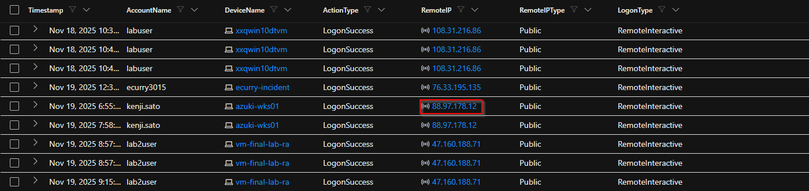

---

## Flag 2 — Initial Access: Compromised User Account

**Question:** Identify the user account that was compromised for initial access.

```kql
let start_time = date(2025-11-19);
let end_time = date(2025-11-20);

DeviceLogonEvents
| where TimeGenerated between (start_time ..end_time )
| where ActionType contains "LogonSuccess"
| where LogonType contains "RemoteInteractive"
| where RemoteIPType contains "Public"
| where isnotempty(RemoteIP)
| project Timestamp, AccountName, DeviceName, ActionType, RemoteIP, RemoteIPType, LogonType
| sort by Timestamp asc
```

**Answer:** `kenji.sato`

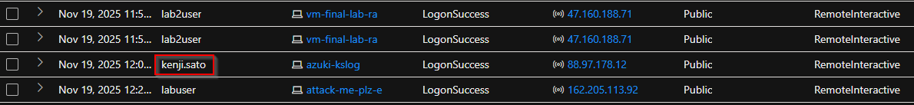

---

## Flag 3 — Discovery: Network Reconnaissance

**Question:** Identify the command and argument used to enumerate network neighbours.

```kql
let start_time = date(2025-11-19);
let end_time = date(2025-11-20);

DeviceProcessEvents
| where TimeGenerated between (start_time .. end_time )
| where ProcessCommandLine contains "Arp"
| where DeviceName contains "azuki"
| project DeviceName, ProcessCommandLine, AccountName
```

**Answer:** `"ARP.EXE" -a`

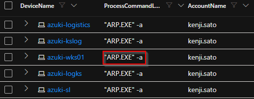

---

## Flag 4 — Defence Evasion: Malware Staging Directory

**Question:** Identify the PRIMARY staging directory where malware was stored.

```kql
let start_time = date(2025-11-19);
let end_time = date(2025-11-20);

DeviceProcessEvents
| where TimeGenerated between (start_time .. end_time )
| where ProcessCommandLine contains "attrib"
| where DeviceName contains "azuki"
| project DeviceName, ProcessCommandLine, FolderPath, FileName
```

**Answer:** `C:\ProgramData\WindowsCache`

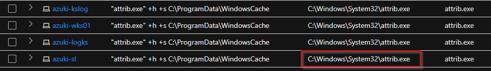

---

## Flag 5 — Defence Evasion: File Extension Exclusions

**Question:** How many file extensions were excluded from Windows Defender scanning?

```kql
let start_time = date(2025-11-19);
let end_time = date(2025-11-20);

DeviceRegistryEvents
| where TimeGenerated between (start_time .. end_time )
| where RegistryKey contains @"Exclusions\Extension"
```

**Answer:** `3`

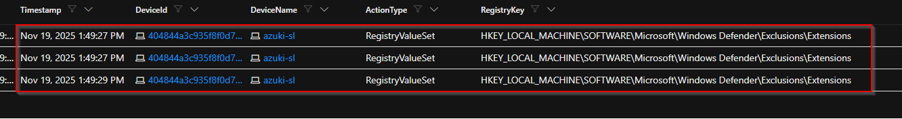

---

## Flag 6 — Defence Evasion: Temporary Folder Exclusion

**Question:** What temporary folder path was excluded from Windows Defender scanning?

```kql
let start_time = date(2025-11-19);
let end_time = date(2025-11-20);

DeviceRegistryEvents
| where TimeGenerated between (start_time ..end_time )
| where RegistryKey contains @"Exclusions\Paths"
```

**Answer:** `C:\Users\KENJI~1.SAT\AppData\Local\Temp`

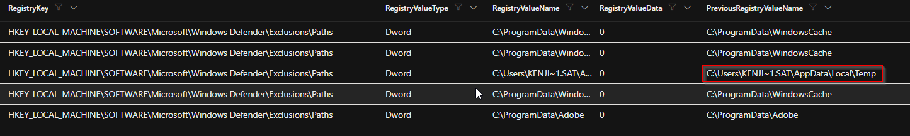

---

## Flag 7 — Defence Evasion: Download Utility Abuse

**Question:** Identify the Windows-native binary the attacker abused to download files.

```kql
let start_time = date(2025-11-19);
let end_time = date(2025-11-20);

DeviceProcessEvents
| where TimeGenerated between (start_time .. end_time)
| where ProcessCommandLine contains "certutil.exe"
   or ProcessCommandLine contains "msiexec.exe"
```

**Answer:** `certutil.exe`

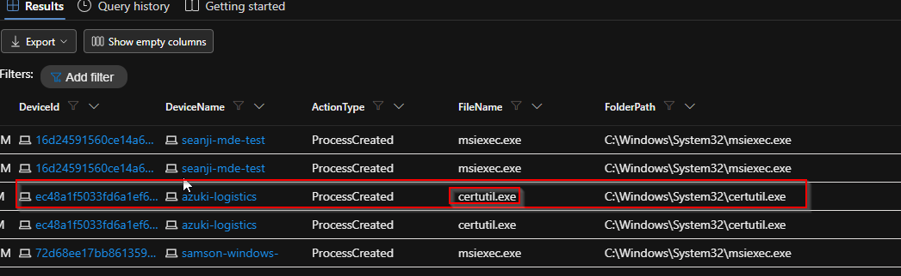

---

## Flag 8 — Persistence: Scheduled Task Name

**Question:** Identify the name of the scheduled task created for persistence.

```kql
let start_time = date(2025-11-19);
let end_time = date(2025-11-20);

DeviceProcessEvents
| where TimeGenerated between (start_time ..end_time )
| where DeviceName contains "azuki"
| where ProcessCommandLine contains "schtasks.exe"
```

**Answer:** `Windows Update Check`

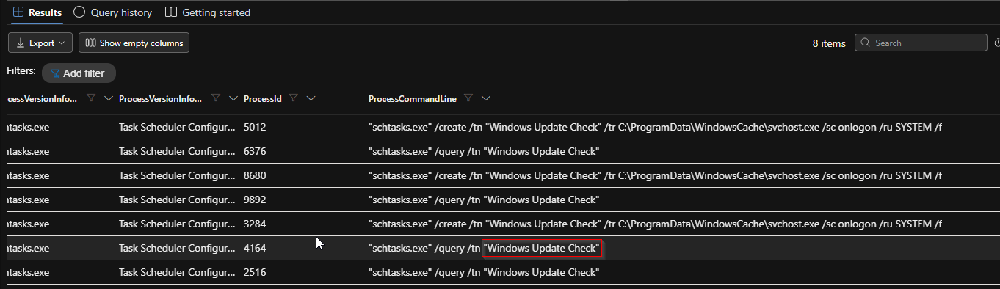

---

## Flag 9 — Persistence: Scheduled Task Target

**Question:** Identify the executable path configured in the scheduled task.

```kql
let start_time = date(2025-11-19);
let end_time = date(2025-11-20);

DeviceProcessEvents
| where TimeGenerated between (start_time ..end_time )
| where DeviceName contains "azuki"
| where ProcessCommandLine contains "schtasks.exe"
   or ProcessCommandLine contains "/tr"
```

**Answer:** `C:\ProgramData\WindowsCache\svchost.exe`

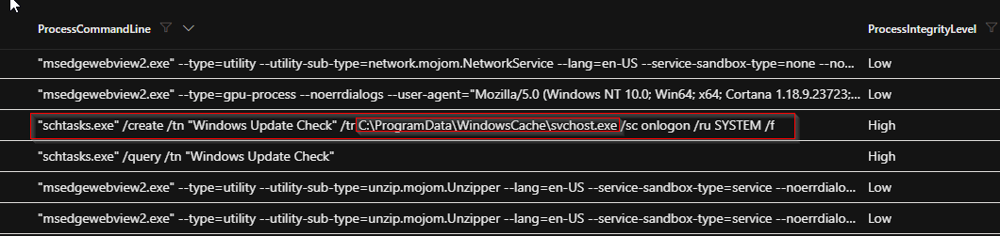

---

## Flag 10 — Command & Control: C2 Server Address

**Question:** Identify the IP address of the command and control server.

```kql
let start_time = date(2025-11-19);
let end_time = date(2025-11-20);

DeviceNetworkEvents
| where TimeGenerated between (start_time ..end_time )
| where DeviceName contains "azuki"
| where ActionType contains "connectionSuccess"
| where InitiatingProcessCommandLine contains "certutil.exe"
```

**Answer:** `78.141.196.6`

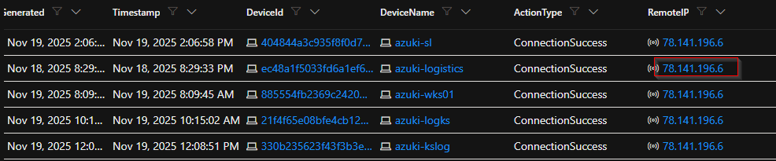

---

## Flag 11 — Command & Control: C2 Communication Port

**Question:** Identify the destination port used for command and control communications.

```kql
let start_time = date(2025-11-19);
let end_time = date(2025-11-20);

DeviceNetworkEvents
| where TimeGenerated between (start_time ..end_time )
| where DeviceName contains "azuki"
| where InitiatingProcessFolderPath contains @"C:\ProgramData\WindowsCache\svchost.exe"
```

**Answer:** `443`

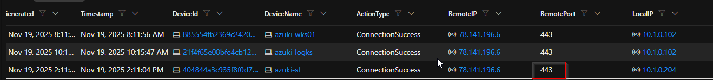

---

## Flag 12 — Credential Access: Credential Theft Tool

**Question:** Identify the filename of the credential dumping tool.

```kql
let start_time = date(2025-11-19);
let end_time = date(2025-11-20);

DeviceFileEvents
| where TimeGenerated between (start_time .. end_time)
| where FolderPath contains "WindowsCache"
| where FileName endswith ".exe"
```

**Answer:** `mm.exe`

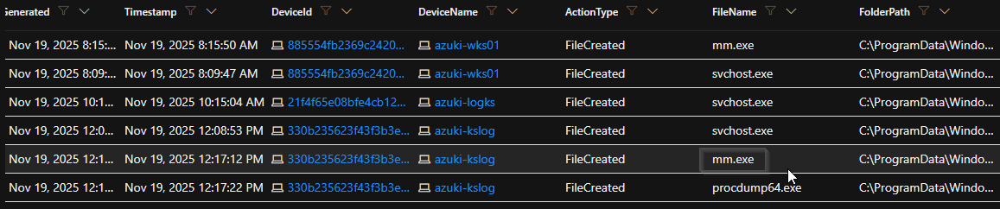

---

## Flag 13 — Credential Access: Memory Extraction Module

**Question:** Identify the module used to extract logon passwords from memory.

```kql
let start_time = date(2025-11-19);
let end_time = date(2025-11-20);

DeviceProcessEvents
| where TimeGenerated between (start_time ..end_time )
| where FolderPath contains "WindowsCache"
| where FileName endswith ".exe"
| project Timestamp, FileName, FolderPath, ProcessCommandLine
| sort by Timestamp asc
```

**Answer:** `sekurlsa::logonpasswords`

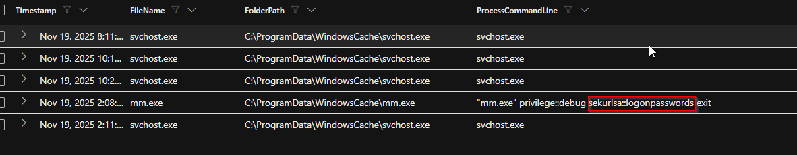

---

## Flag 14 — Collection: Data Staging Archive

**Question:** Identify the compressed archive filename used for data exfiltration.

```kql
let start_time = date(2025-11-19);
let end_time = date(2025-11-20);

DeviceFileEvents
| where TimeGenerated between (start_time .. end_time)
| where DeviceName contains "azuki"
| where FileName endswith ".zip"
| where FolderPath contains @"C:\ProgramData\WindowsCache"
```

**Answer:** `export-data.zip`

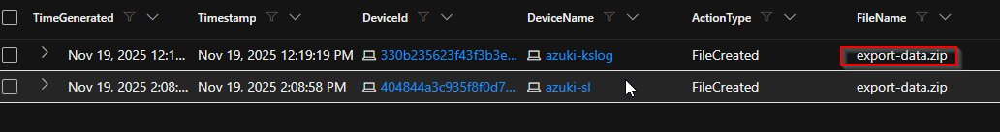

---

## Flag 15 — Exfiltration: Exfiltration Channel

**Question:** Identify the cloud service used to exfiltrate stolen data.

```kql
let start_time = date(2025-11-19);
let end_time = date(2025-11-20);

DeviceNetworkEvents
| where TimeGenerated between (start_time .. end_time)
| where DeviceName contains "azuki"
| where isnotempty(RemoteUrl)
| where InitiatingProcessCommandLine contains "WindowsCache"
```

**Answer:** `discord`

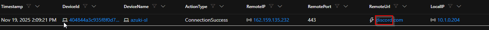
---

## Flag 16 — Anti-Forensics: Log Tampering

**Question:** Identify the first Windows event log cleared by the attacker.

```kql
let start_time = date(2025-11-19);
let end_time = date(2025-11-20);

DeviceProcessEvents
| where TimeGenerated between (start_time ..end_time )
| where DeviceName contains "azuki"
| where ProcessCommandLine contains "wevtutil.exe"
| project DeviceName, ProcessCommandLine, FolderPath, FileName, TimeGenerated
| order by TimeGenerated asc
```

**Answer:** `Security`

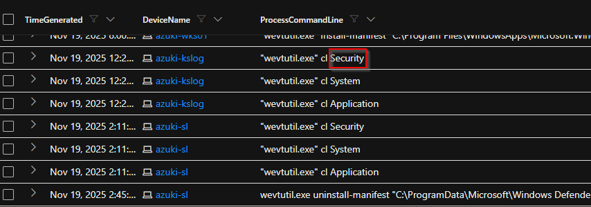

---

## Flag 17 — Impact: Persistence Account

**Question:** Identify the backdoor account username created by the attacker.

```kql
let start_time = date(2025-11-19);
let end_time = date(2025-11-20);

DeviceProcessEvents
| where TimeGenerated between (start_time ..end_time )
| where ProcessCommandLine contains @"/add"
| project DeviceName, ProcessCommandLine, FolderPath, FileName, TimeGenerated
| order by TimeGenerated asc
```

**Answer:** `support`

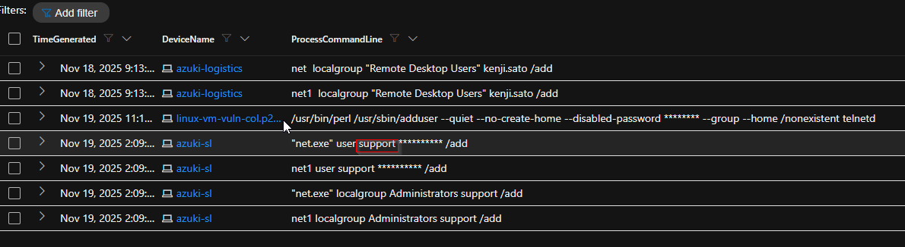

---

## Flag 18 — Execution: Malicious Script

**Question:** Identify the PowerShell script file used to automate the attack chain.

```kql
let start_time = date(2025-11-19);
let end_time = date(2025-11-20);

DeviceFileEvents
| where TimeGenerated between (start_time ..end_time )
| where DeviceName contains "azuki"
| where FileName endswith ".ps1"
| where FolderPath contains "temp"
```

**Answer:** `wupdate.ps1`

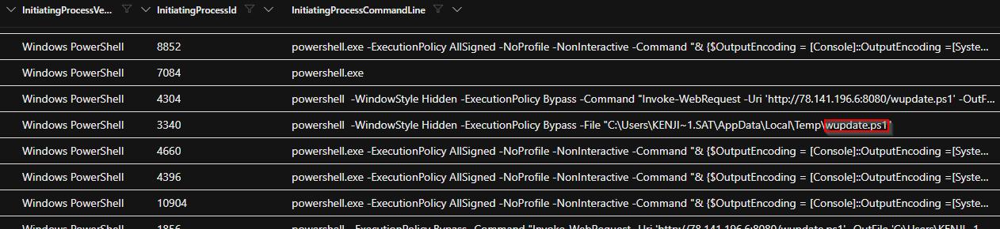

---

## Flag 19 — Lateral Movement: Secondary Target

**Question:** What IP address was targeted for lateral movement?

```kql
let start_time = date(2025-11-19);
let end_time = date(2025-11-20);

DeviceProcessEvents
| where TimeGenerated between (start_time .. end_time)
| where DeviceName contains "azuki"
| where ProcessCommandLine contains " cmdkey"
   or ProcessCommandLine contains "mstsc"
| project DeviceName, ProcessCommandLine, FileName
```

**Answer:** `10.1.0.188`

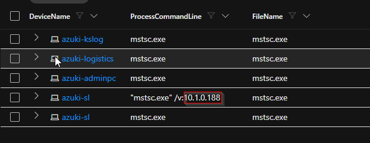

---

## Flag 20 — Lateral Movement: Remote Access Tool

**Question:** Identify the remote access tool used for lateral movement.

```kql
let start_time = date(2025-11-19);
let end_time = date(2025-11-20);

DeviceProcessEvents
| where TimeGenerated between (start_time .. end_time)
| where DeviceName contains "azuki"
| where ProcessCommandLine has_any ("rdp","10.", "/v:")
```

**Answer:** `mstsc.exe`

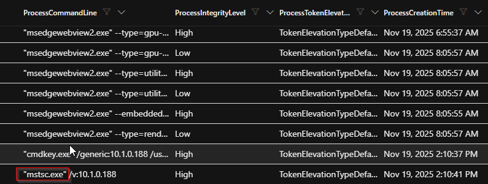

---

## Skills Demonstrated

- Microsoft Defender for Endpoint Advanced Hunting
- Kusto Query Language (KQL)
- Incident Response
- Threat Hunting
- Windows Process Analysis
- Registry Analysis
- Network Analysis
- Credential Access Investigation
- Exfiltration Investigation
- MITRE ATT&CK Mapping
- Lateral Movement Analysis


```

## Disclaimer

This project was completed in a controlled threat-hunting lab environment for educational and portfolio purposes. The queries and findings are intended to demonstrate investigation methodology using Microsoft Defender for Endpoint and KQL.
